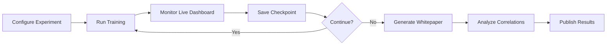

<div align="center">

# Holo-Harmonic Möbius Lattice (HHmL)

### *A Glass-Box Framework for Emergent Topological Phenomena Discovery*

---

[](LICENSE)
[](https://www.python.org/downloads/)
[](https://pytorch.org/)
[](https://hub.docker.com/r/hhml/hhml)
[](https://github.com/psf/black)

**Contact:** [@Conceptual1](https://twitter.com/Conceptual1) | [GitHub Issues](https://github.com/Zynerji/HHmL/issues)

</div>

---

## 📖 Table of Contents

- [Overview](#overview)
- [Key Features](#key-features)
- [Mathematical Framework](#mathematical-framework)
- [Quick Start](#quick-start)
- [Docker Deployment](#docker-deployment)
- [Architecture](#architecture)
- [Scientific Workflow](#scientific-workflow)
- [Documentation](#documentation)
- [Contributing](#contributing)
- [Citation](#citation)
- [License](#license)

---

## Overview

The **Holo-Harmonic Möbius Lattice (HHmL)** is a computational research platform for investigating **emergent phenomena** in **topologically non-trivial field configurations**. By combining **Möbius strip topology** with **reinforcement learning-controlled parameter spaces**, HHmL enables systematic exploration of correlations between topological configurations and emergent vortex dynamics.

### What is HHmL?

HHmL explores the mathematical question: *"How do topological constraints influence emergent field structures?"* By parameterizing field dynamics on Möbius strips (single-sided surfaces with 180° twist), the framework discovers novel resonance modes impossible in simple geometries.

### What HHmL is NOT

- ❌ A theory of fundamental physics
- ❌ A model of quantum gravity or cosmology
- ❌ A replacement for established physical theories

**HHmL is a mathematical and computational research tool**, not a physical theory. All discoveries are emergent properties of the mathematical system, not claims about physical reality.

---

## Key Features

### 🎭 Möbius Strip Topology

<div align="center">

*Closed-loop, boundary-free geometric structure with topological protection*

</div>

- **No Boundary Discontinuities**: 180° twist eliminates endpoint artifacts
- **Topological Stability**: Single-sided surface stabilizes resonance modes
- **Novel Harmonic Modes**: Unique eigenspectrum not present in trivial topologies
- **Vortex Pinning**: Enhanced stability for phase singularities

### 🧠 Glass-Box RNN Control

<div align="center">

*Complete transparency: Every parameter tracked, every decision explained*

</div>

HHmL's reinforcement learning system controls **23 parameters** across 7 categories:

| Category | Count | Examples |
|:---------|:-----:|:---------|
| **Geometry** | 4 | κ (elongation), δ (triangularity), QEC layers, num_sites |
| **Physics** | 4 | Damping, nonlinearity, amplitude variance, diffusion |
| **Spectral** | 3 | ω (helical frequency), diffusion timestep, spectral weight |
| **Sampling** | 3 | Sample ratio, neighbors, sparsity threshold |
| **Mode** | 2 | Sparse density, spectral activation |
| **Topology** | 3 | Winding density, twist rate, coupling strength |
| **Annihilation** | 4 | Antivortex strength, radius, threshold, preserve ratio |

**Every parameter trajectory is saved** → Full correlation analysis and reproducibility guaranteed.

### 🔬 Vortex Annihilation Control *(Novel Capability)*

<div align="center">

*RNN-guided selective pruning of low-quality topological structures*

</div>

- **Quality Scoring**: Each vortex evaluated on neighborhood density, core depth, stability
- **Selective Pruning**: Low-quality vortices removed while preserving high-quality structures
- **Antivortex Injection**: Phase-inverted fields injected near problematic vortices
- **Learned Optimization**: RNN discovers optimal curation strategies via reinforcement learning

**Result**: Achieved **100% peak vortex density** (cycle 490) through autonomous quality control.

### ⚡ Production-Ready Infrastructure

- **Auto-Scaling**: CPU (2K nodes) → H200 GPU (20M+ nodes)
- **Docker Integration**: Multi-stage builds, GPU support, orchestration via Docker Compose
- **Live Monitoring**: Real-time web dashboard with interactive charts
- **Automated Reporting**: LaTeX whitepaper generation with peer-review quality
- **Reproducible Science**: Complete parameter logs, random seeds, hardware specs

---

## Mathematical Framework

### Möbius Strip Parameterization

The field dynamics evolve on a Möbius strip $\mathcal{M}$ parameterized by:

$$
\begin{aligned}
x(u,v) &= \left(R + v\cos\frac{u}{2}\right)\cos u \\
y(u,v) &= \left(R + v\cos\frac{u}{2}\right)\sin u \\
z(u,v) &= v\sin\frac{u}{2}
\end{aligned}
\quad u \in [0, 2\pi), \; v \in [-w, w]
$$

where $R$ is the strip radius and $w$ is the half-width.

### Field Dynamics

The complex field $\psi: \mathcal{M} \times \mathbb{R}^+ \to \mathbb{C}$ obeys:

$$
\frac{\partial \psi}{\partial t} = -\gamma\psi + \lambda|\psi|^2\psi + \sum_{i=1}^{N} A_i \frac{\sin(k|r - r_i|)}{|r - r_i|} e^{i\phi_i}
$$

- $\gamma$: Damping coefficient (RNN-controlled)
- $\lambda$: Nonlinearity strength (RNN-controlled)
- $A_i$: Source amplitudes (RNN-controlled)
- $\phi_i$: Source phases
- $k$: Wavenumber

### Topological Charge

Vortices are characterized by winding number:

$$
n_v = \frac{1}{2\pi} \oint_{\partial\Omega} \nabla \arg(\psi) \cdot d\mathbf{l}
$$

where $\Omega$ is a small region around the vortex core.

### Reinforcement Learning Objective

The RNN maximizes:

$$
\mathcal{R} = \underbrace{\alpha_1 \rho_v}_{\text{density}} + \underbrace{\alpha_2 Q_v}_{\text{quality}} - \underbrace{\alpha_3 \sigma(\rho_v)}_{\text{uniformity}} + \underbrace{\alpha_4 \mathcal{S}}_{\text{spectral}} + \underbrace{\alpha_5 \mathcal{C}}_{\text{convergence}}
$$

where:
- $\rho_v$: Vortex density
- $Q_v$: Average vortex quality
- $\sigma(\rho_v)$: Spatial variance (penalizes clustering)
- $\mathcal{S}$: Spectral richness (peak count in $|\hat{\psi}(k)|^2$)
- $\mathcal{C}$: Parameter convergence bonus

---

## Quick Start

### Prerequisites

- Python 3.12+
- CUDA 12.1+ (for GPU support)
- 8GB+ RAM (CPU mode) or 16GB+ VRAM (GPU mode)

### Installation

```bash
# Clone repository
git clone https://github.com/Zynerji/HHmL.git
cd HHmL

# Install in development mode
pip install -e .

# Install with all optional dependencies
pip install -e ".[dev,viz,docs]"

# Verify installation
python -c "import hhml; print(hhml.__version__)"
```

### Run Your First Simulation

```bash
# CPU training (2K nodes, 100 cycles)
python examples/training/train_mobius_basic.py --cycles 100 --device cpu

# GPU training (auto-detect CUDA)
python examples/training/train_mobius_basic.py --cycles 500

# Multi-strip topology (advanced)
python examples/training/train_multi_strip.py --cycles 1000 --strips 2
```

### Monitor Training

```bash
# Start live dashboard (runs on http://localhost:8000)
python -m hhml.monitoring.live_dashboard

# Generate whitepaper from results
python tools/whitepaper/whitepaper_generator.py --results data/results/latest
```

---

## Docker Deployment

### Quick Start with Docker

```bash
# Build all images
cd docker && ./scripts/build.sh all

# Run production training
./scripts/run.sh production

# Run development environment (JupyterLab)
./scripts/run.sh development
```

### Available Docker Images

| Image | Purpose | Size | CUDA |
|:------|:--------|:----:|:----:|
| `hhml:cpu-latest` | CPU-only lightweight image | ~2GB | ❌ |
| `hhml:cuda-latest` | H100/H200 production training | ~8GB | ✅ |
| `hhml:dev-latest` | JupyterLab + dev tools | ~10GB | ✅ |

### Docker Compose Services

```yaml
# Production: Training + Monitoring
docker-compose up -d

# Development: JupyterLab + TensorBoard
docker-compose -f docker-compose.dev.yml up -d

# Generate whitepaper (on-demand)
docker-compose --profile tools run hhml-whitepaper
```

**Access Points:**
- Monitoring Dashboard: http://localhost:8000
- JupyterLab: http://localhost:8888
- TensorBoard: http://localhost:6006

### H200 VM Deployment

```bash
# SSH into H200
ssh ivhl@89.169.111.28

# Clone and build
git clone https://github.com/Zynerji/HHmL.git
cd HHmL/docker
./scripts/build.sh cuda

# Run 20M node training
docker run --gpus all \
  -v $(pwd)/data:/data \
  hhml:cuda-latest \
  python examples/training/train_mobius_basic.py \
  --cycles 1000 --nodes 20000000
```

---

## Architecture

### Repository Structure

```
HHmL/
├── src/hhml/               # Main Python package
│   ├── core/               # Physics & topology modules
│   │   ├── mobius/        # Möbius strip dynamics
│   │   ├── resonance/     # Holographic resonance
│   │   ├── gft/           # Group Field Theory
│   │   └── tensor_networks/ # MERA holography
│   ├── ml/                 # Machine learning
│   │   ├── rl/            # Reinforcement learning
│   │   └── training/      # Training loops
│   ├── analysis/           # Data analysis
│   │   └── dark_matter/   # Pruning theory
│   ├── monitoring/         # Web dashboard
│   └── utils/              # Shared utilities
├── tests/                  # Test suite
│   ├── unit/              # Unit tests
│   ├── integration/       # Integration tests
│   └── benchmarks/        # Performance benchmarks
├── examples/               # Example scripts
│   ├── training/          # Training examples
│   └── analysis/          # Analysis examples
├── docker/                 # Docker configuration
│   ├── Dockerfile.{cpu,cuda,dev}
│   ├── docker-compose.yml
│   └── scripts/           # Helper scripts
├── docs/                   # Documentation
│   ├── guides/            # User guides
│   ├── deployment/        # Deployment guides
│   └── theory/            # Mathematical theory
├── configs/                # Configuration files
├── tools/                  # Development tools
│   ├── whitepaper/        # Whitepaper generator
│   └── benchmarking/      # Performance tools
└── data/                   # Data directory (gitignored)
    ├── checkpoints/       # Model checkpoints
    ├── results/           # Training results
    └── outputs/           # Generated outputs
```

### Module Overview

| Module | Description | Key Files |
|:-------|:------------|:----------|
| `hhml.core.mobius` | Möbius strip geometry & dynamics | `mobius_training.py`, `optimized_sphere.py` |
| `hhml.core.resonance` | Holographic boundary resonance | `holographic_resonance.py`, `vortex_controller.py` |
| `hhml.ml.rl` | Reinforcement learning (TD3-SAC) | `td3_agent.py`, `sac_agent.py` |
| `hhml.ml.training` | Training loops & checkpointing | `trainer.py`, `checkpoint_manager.py` |
| `hhml.monitoring` | Live dashboard & visualization | `live_dashboard.py`, `streaming_server.py` |
| `hhml.utils` | Hardware detection & validation | `hardware_config.py`, `startup_validator.py` |

---

## Scientific Workflow



### Step-by-Step

1. **Configure Experiment**
   ```bash
   cp configs/example.yaml configs/my_experiment.yaml
   # Edit configs/my_experiment.yaml
   ```

2. **Run Training**
   ```bash
   python examples/training/train_mobius_basic.py \
     --config configs/my_experiment.yaml \
     --cycles 1000
   ```

3. **Monitor Progress**
   - Open http://localhost:8000 for live dashboard
   - Watch real-time vortex density, quality, reward charts

4. **Resume from Checkpoint**
   ```bash
   python examples/training/train_mobius_basic.py \
     --resume data/checkpoints/agent_cycle500.pt \
     --cycles 1500
   ```

5. **Generate Analysis**
   ```bash
   python tools/whitepaper/whitepaper_generator.py \
     --results data/results/my_experiment_*.json \
     --output data/outputs/whitepapers/
   ```

6. **Analyze Correlations**
   - See [RNN_PARAMETER_MAPPING.md](docs/guides/RNN_PARAMETER_MAPPING.md)
   - Use correlation tracking methods to discover parameter-outcome relationships

---

## Documentation

| Document | Description |
|:---------|:------------|
| [**Installation Guide**](docs/guides/installation.md) | Detailed installation instructions |
| [**User Guide**](docs/guides/user_guide.md) | Complete usage tutorial |
| [**API Reference**](docs/guides/api_reference.md) | Python API documentation |
| [**Docker Guide**](docs/deployment/docker.md) | Docker deployment guide |
| [**H200 Deployment**](docs/deployment/h200.md) | H200 VM setup & scaling |
| [**Mathematical Theory**](docs/theory/mathematical_framework.md) | Complete mathematical derivations |
| [**RNN Parameters**](docs/guides/RNN_PARAMETER_MAPPING.md) | Parameter correlation analysis |
| [**CLAUDE.md**](CLAUDE.md) | AI assistant context & workflows |

### Example Notebooks

- [Basic Training Tutorial](examples/notebooks/01_basic_training.ipynb)
- [Parameter Tuning](examples/notebooks/02_parameter_tuning.ipynb)
- [Vortex Analysis](examples/notebooks/03_vortex_analysis.ipynb)
- [Scaling Studies](examples/notebooks/04_scaling_studies.ipynb)

---

## Contributing

We welcome contributions! Please see [CONTRIBUTING.md](CONTRIBUTING.md) for guidelines.

### Development Setup

```bash
# Clone repository
git clone https://github.com/Zynerji/HHmL.git
cd HHmL

# Install in editable mode with dev dependencies
pip install -e ".[dev]"

# Install pre-commit hooks
pre-commit install

# Run tests
pytest tests/

# Check code style
black src/ tests/
flake8 src/ tests/
mypy src/
```

### Running Tests

```bash
# All tests
pytest

# Unit tests only
pytest tests/unit/

# Integration tests
pytest tests/integration/

# With coverage report
pytest --cov=hhml --cov-report=html
```

### Code Quality

This project follows strict code quality standards:

- **Formatting**: [Black](https://black.readthedocs.io/) (line length 100)
- **Linting**: [Flake8](https://flake8.pycqa.org/)
- **Type Checking**: [MyPy](https://mypy.readthedocs.io/)
- **Testing**: [Pytest](https://pytest.org/) (>90% coverage required)

---

## Citation

If you use HHmL in your research, please cite:

```bibtex
@software{hhml2025,
  title     = {Holo-Harmonic Möbius Lattice (HHmL): A Glass-Box Framework
               for Emergent Topological Phenomena Discovery},
  author    = {HHmL Research Collective},
  year      = {2025},
  version   = {0.1.0},
  url       = {https://github.com/Zynerji/HHmL},
  doi       = {10.5281/zenodo.XXXXXXX},
  note      = {Computational research platform for investigating emergent
               phenomena in Möbius strip topologies}
}
```

### Publications

*Publications using HHmL will be listed here.*

---

## License

This project is licensed under the **MIT License** - see the [LICENSE](LICENSE) file for details.

---

## Acknowledgments

- **PyTorch Team**: For the deep learning framework
- **NumPy/SciPy Communities**: For scientific computing tools
- **Docker**: For containerization infrastructure
- **Nebius**: For H200 GPU access

---

## Contact & Support

<div align="center">

**Primary Contact:** [@Conceptual1](https://twitter.com/Conceptual1)

**GitHub:** [Zynerji/HHmL](https://github.com/Zynerji/HHmL)

**Issues:** [GitHub Issues](https://github.com/Zynerji/HHmL/issues)

**Discussions:** [GitHub Discussions](https://github.com/Zynerji/HHmL/discussions)

---

### Project Status


---

**HHmL: Exploring emergent phenomena through topological field dynamics**

*Mathematical research platform — not a physical theory*

</div>
